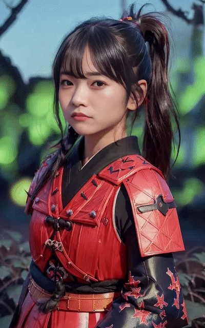
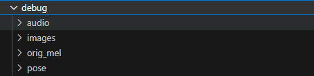

# Sadtalker Train

thanks for the excellent works [Sadtalker](https://github.com/OpenTalker/SadTalker)

| official result                 | my code result       |
|:--------------------: |:--------------------: |
|  |   | 


## TODO: 
- [x] Data preprocessing.
- [x] PoseNet training codes.
- [ ] ExpNet training codes.

## Data preprocessing: 

### extract audio、face image and β
```bash
python data_preprocess.py 
```

### save original mel for save time in training.
```bash
python save_orig_mel.py 
```
After data preprocessing, your data directory structure should be as follows:



### write train list with label

```bash
python write_train_list.py --data_dir <your image dir>
```
In paper, the labels ranges from 0 to 45.
In my work, the characters in each video are different, so the labels for each video are different. 
If there are duplicate characters in your videos, you may need to rewrite write_train_list.py.

## Train PoseNet: 

before training, you should download the pretrained model and put it in ./checkpoints

```bash
python train_posevae.py --save_dir <save root dir>
                        --save_name <save name>
                        --train_data_path <your train data txt>
                        --num_class <your num_class>
Note that the num_class must equals to the label in train list. In paper, num_class is 46.
```

## Test your model: 

### merge some parameters from pretrained model, eg:ExpNet
```bash
python rewrite_safemodel.py                     
```

### inference
```bash
python inference.py --driven_audio <audio.wav> \
                    --source_image <picture.png> \
                    --checkpoint_dir <latest.safetensors merged from rewrite_safemodel.py>
                    --enhancer gfpgan   
                    --pose_style <your pose_style>              
```
